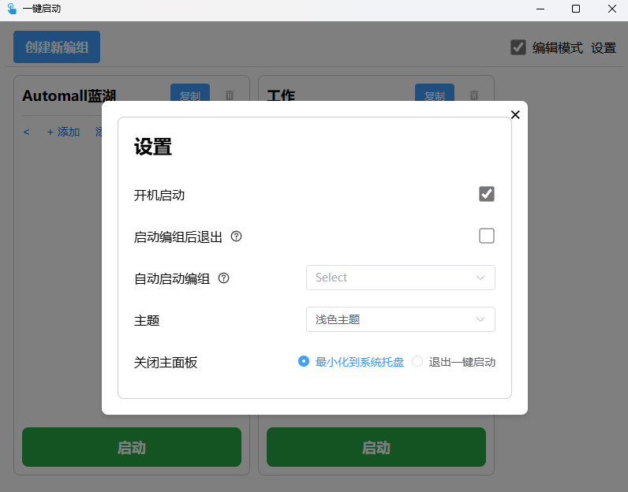

# 一键启动

## 项目简介

**一键启动** 是专注于提升操作效率的智能资源管理工具，支持快速批量启动多种类型资源。核心解决多任务场景下的重复操作痛点。

### 核心能力
- **批量启动**：单次操作同时打开多个文件/网址/应用程序
- **场景分类**：自由创建「办公」「开发」「日常」等不同场景启动组
- **灵活管理**：
    - 拖放文件/网址快速创建启动项
    - 支持窗口布局记忆与主题切换（深色/浅色模式）
    - 提供便携版无需安装

### 适用场景
- 日常需要同时打开多个办公文档
- 开发人员需要快速启动编程环境套件
- 设计师需一键加载创意工具集
- 开机自动加载办公文档与通讯软件
- PPT制作时同步启动素材库与设计工具

**视频介绍:**
[BiliBili视频介绍](https://www.bilibili.com/video/BV1LgN8ejEsS/)

## 安装方式

提供两种安装版本供用户选择：

### 安装版

**1. 使用`setup.exe`或`.msi`文件安装**
适合大部分 Windows 用户，提供简洁的安装引导界面：

1. 下载 `一键启动_x64-setup.exe`或`一键启动_x64_zh-CN.msi` (
   如：一键启动_1.0.0_x64-setup.exe,一键启动_1.0.0_x64_zh-CN.msi)。
2. 双击文件后，按照提示完成安装。
3. 安装完成后，桌面和“开始菜单”会创建快捷方式，点击即可启动程序。

### 便携版

**使用`portable.exe`文件直接打开**

1. **下载便携版**：
    - 下载 `一键启动_portable.exe` (如：一键启动_1.0.2_portable.exe)。

2. **直接运行**：
    - 双击 `一键启动_portable.exe` 文件即可启动程序，无需安装。
    - 所有数据（如配置文件、数据库）将存储在可执行文件所在的目录中，方便携带和迁移。

## 版本说明

### v1.0.2 | 2025-03-02

**✨ 新增功能**

- 新增主题功能（浅色模式/深色模式）
- 支持文件拖放快捷添加资源或创建编组
- 新增“自启动编组”功能（开机启动时自动运行指定编组）
- 支持窗口自定义大小
- 新增保存窗口位置与大小功能（重启后自动恢复）
- 支持打开单个资源
- 支持便携版应用程序
- 新增退出选项（退出程序或最小化到系统托盘）

**🛠 优化与改进**

- 优化人机交互体验
- 代码结构与性能优化
- 多显示器分辨率适配

**⚙️ 技术更新**

- 升级 Rust 依赖至 2024 版本

**历史版本**

- v1.0.1 | 2025-01-23

    **🎯 功能改进**
    - 优化系统图标与系统托盘的展示。

- v1.0.0 | 2025-01-19

    **🎉 基础功能**
    - 启动器编组管理核心功能上线
    - 实现一键打开多文件/文件夹/网址
    - 支持开机自启基础功能

## 使用方式

### 1. 初次启动

安装完成后，运行“一键启动”程序，默认会进入编辑模式，用户可以开始创建启动器：

1. 点击 `创建启动器` 按钮,会生成一个带有随机名称的空启动器，双击名称为启动器重命名（如“工作”、“娱乐”）。
2. 在启动器中添加资源：
    - 点击 `添加` 或 `添加文件夹` ，选择需要打开的资源(可以是任意文档,应用程序等)。
    - 点击 `添加网址` ，输入网址名称和链接。
3. 添加完成后，点击 `启动` 按钮即可打开启动器中的所有资源。启动成功后主窗口将自动隐藏。


### 2. 切换阅读模式

取消勾选 `编辑模式` ，启动器界面将变为`阅读模式`，此时不能编辑启动器内容，仅用于启动资源和调整资源顺序。


### 3. 系统托盘操作

“一键启动”关闭后默认最小化到系统托盘，并提供右键菜单：

- **快速启动：** 直接点击某个启动器名称即可启动其资源。
- **退出程序：** 关闭“一键启动”。


### 4. 设置页面



## 手动运行源码

如果希望自定义或基于源码运行程序，可以按照以下步骤操作：

### 1. 环境要求

在开始之前，请确保你已经安装以下必要的环境：

- **Rust 环境：** 安装 [Rust编译器](https://www.rust-lang.org/) (推荐使用最新的稳定版本)。
    - 安装后，运行以下命令确保 Rust 和 cargo 可用：

      ```bash
      rustc --version  
      cargo --version 
      ```

- **Node.js环境:** [安装Node.js](https://nodejs.org/) (推荐使用 18.x 或以上版本)。
    - 安装后，运行以下命令检查 Node.js 和 npm 是否可用：

      ```bash
      node -v  
      npm -v  
      ```

- **Tauri CLI：** 安装 [Tauri CLI](https://tauri.app/)，用于管理 Tauri 的开发和构建：

    ```bash
    cargo install create-tauri-app --locked
    ```

- SQLite: 确保系统上支持 SQLite 数据库，因为项目使用 `sqlx` 和 `SQLite` 作为数据存储后端。

### 2. 克隆项目

使用 Git 克隆项目代码到本地:

```bash
git clone https://gitee.com/silwings/one-click-launch.git
cd one-click-launch
```

### 3. 安装前端依赖

进入项目目录后，通过 `npm` 安装前端依赖：

```bash
npm install  
```

如果使用的是 `yarn` 或 `pnpm`，可以替换为：

```bash
yarn install  
# 或  
pnpm install  
```

### 4. 开发环境运行

运行 Tauri 开发模式

```bash
cargo tauri dev
```

若页面无法右键检查,可先将`index.html`文件中的`阻止默认右键菜单`代码块注释。

由于设置了单例模式,无法启动多个应用程序实例,若启动应用程序失败,请检查是否已存在正在运行的当前应用程序。

### 5. 构建生产版本

运行 Tauri 生产模式

```bash
# 构建安装版
cargo tauri build

# 构建便携版
cargo tauri build --features portable
```

构建完成后，生成的可执行文件将在 `/src-tauri/target/release/` 目录中，你可以将其分发给用户。

### 6. 修改和自定义代码

**修改前端代码**
前端使用 Vue 3 和 TypeScript 开发，源代码位于 src/ 目录。

- 例如：你可以在 src/components 中修改 UI 组件或逻辑。

**修改后端代码**
后端使用 Rust 开发，源代码位于 `src-tauri/` 目录。

- 插件配置可以在 `src-tauri/tauri.conf.json` 中调整。
- 业务逻辑可以在 `src-tauri/src/` 中编写或修改。

修改后可以使用以下命令进行开发测试或重新构建：

```bash
cargo tauri dev  # 开发模式  
cargo tauri build  # 生产模式  
```

## 联系我们

如有任何问题或反馈，请通过以下方式联系我们：

- 邮箱：<silwings@163.com>
- Gitee: [https://gitee.com/silwings](https://gitee.com/silwings)
- GitHub: [https://github.com/Silwings-git](https://github.com/Silwings-git)