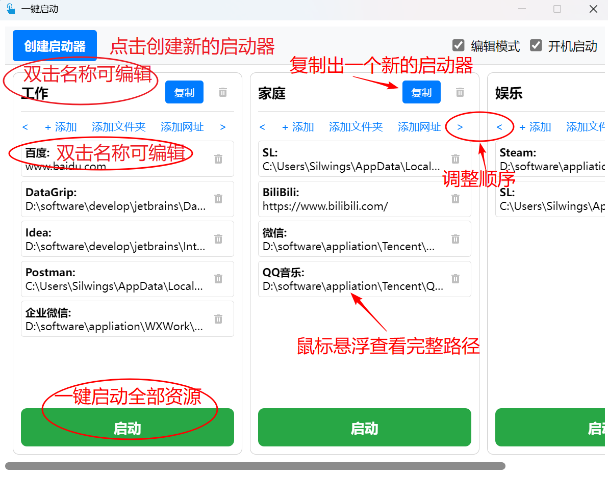

# 一键启动

## 项目简介

“一键启动”是一款高效、便捷的资源管理工具，旨在帮助用户快速打开多个常用的文件、文件夹和网址。通过创建启动器，用户可以将不同场景的资源（如工作、家庭、娱乐等）分类管理，并实现一键式启动，极大提升操作效率和用户体验。

**功能亮点：**

- **自定义启动器：** 可以自由创建多个启动器，每个启动器中可以包含文件、文件夹和网址等资源。
- **一键启动：** 点击启动按钮即可打开启动器中的所有资源，支持使用默认程序或浏览器打开。
- **编辑/阅读模式：** 在编辑模式中管理启动器，切换到阅读模式时避免误操作。
- **系统托盘快速启动：** 无需打开软件界面，通过托盘右键菜单即可快捷启动启动器。
- **开机启动：** 支持开机自动运行软件，快速进入工作状态。

## 安装方式

提供两种安装文件供用户选择：

**1. 使用`.exe`文件安装**
适合大部分 Windows 用户，提供简洁的安装引导界面：

   1. 下载 `一键启动_x64-setup.exe` (如：一键启动_1.0.0_x64-setup.exe)。
   2. 双击文件后，按照提示完成安装。
   3. 安装完成后，桌面和“开始菜单”会创建快捷方式，点击即可启动程序。

**2. 使用`.msi`文件安装**
适合高级用户或需要批量部署的场景：

  1. 下载 `一键启动_x64_zh-CN.msi` (如：一键启动_1.0.0_x64_zh-CN.msi)。
  2. 双击文件后，按照提示完成安装。
  3. 安装完成后，可以直接从“开始菜单”启动程序。

## 使用方式

### 1. 初次启动

安装完成后，运行“一键启动”程序，默认会进入编辑模式，用户可以开始创建启动器：

1. 点击 `创建启动器` 按钮,会生成一个带有随机名称的空启动器，双击名称为启动器重命名（如“工作”、“娱乐”）。
2. 在启动器中添加资源：
   - 点击 `添加` 或 `添加文件夹` ，选择需要打开的资源(可以是任意文档,应用程序等)。
   - 点击 `添加网址` ，输入网址名称和链接。
3. 添加完成后，点击 `启动` 按钮即可打开启动器中的所有资源。启动成功后主窗口将自动隐藏。



### 2. 切换阅读模式

取消勾选 `编辑模式` ，启动器界面将变为`阅读模式`，此时不能编辑启动器内容，仅用于启动资源和调整资源顺序。


### 3. 系统托盘操作

“一键启动”关闭后默认最小化到系统托盘，并提供右键菜单：

- **快速启动：** 直接点击某个启动器名称即可启动其资源。
- **退出程序：** 关闭“一键启动”。


### 4. 开机启动

勾选 `开机启动` 选项，程序会在每次开机时自动运行。

## 手动运行源码

如果希望自定义或基于源码运行程序，可以按照以下步骤操作：

### 1. 环境要求

在开始之前，请确保你已经安装以下必要的环境：

- **Rust 环境：** 安装 [Rust编译器](https://www.rust-lang.org/) (推荐使用最新的稳定版本)。
  - 安装后，运行以下命令确保 Rust 和 cargo 可用：

    ```bash
    rustc --version  
    cargo --version 
    ```

- **Node.js环境:** [安装Node.js](https://nodejs.org/) (推荐使用 18.x 或以上版本)。
  - 安装后，运行以下命令检查 Node.js 和 npm 是否可用：
  
    ```bash
    node -v  
    npm -v  
    ```

- **Tauri CLI：** 安装 [Tauri CLI](https://tauri.app/)，用于管理 Tauri 的开发和构建：

    ```bash
    cargo install create-tauri-app --locked
    ```

- SQLite: 确保系统上支持 SQLite 数据库，因为项目使用 `sqlx` 和 `SQLite` 作为数据存储后端。

### 2. 克隆项目

使用 Git 克隆项目代码到本地:

```bash
git clone https://gitee.com/silwings/one-click-launch.git
cd one-click-launch
```

### 3. 安装前端依赖

进入项目目录后，通过 `npm` 安装前端依赖：

```bash
npm install  
```

如果使用的是 `yarn` 或 `pnpm`，可以替换为：

```bash
yarn install  
# 或  
pnpm install  
```

### 4. 开发环境运行

运行 Tauri 开发模式

```bash
cargo tauri dev
```

若页面无法右键检查,可先将`index.html`文件中的`阻止默认右键菜单`代码块注释。

由于设置了单例模式,无法启动多个应用程序实例,若启动应用程序失败,请检查是否已存在正在运行的当前应用程序。

### 5. 构建生产版本

运行 Tauri 生产模式

```bash
cargo tauri build
```

构建完成后，生成的可执行文件将在 `/src-tauri/target/release/` 目录中，你可以将其分发给用户。

### 6. 修改和自定义代码

**修改前端代码**
前端使用 Vue 3 和 TypeScript 开发，源代码位于 src/ 目录。

- 例如：你可以在 src/components 中修改 UI 组件或逻辑。

**修改后端代码**
后端使用 Rust 开发，源代码位于 `src-tauri/` 目录。

- 插件配置可以在 `src-tauri/tauri.conf.json` 中调整。
- 业务逻辑可以在 `src-tauri/src/` 中编写或修改。

修改后可以使用以下命令进行开发测试或重新构建：

```bash
cargo tauri dev  # 开发模式  
cargo tauri build  # 生产模式  
```

## 联系我们

如有任何问题或反馈，请通过以下方式联系我们：

- 邮箱：<silwings@163.com>
- Gitee：[https://gitee.com/silwings](https://gitee.com/silwings)
- GitHub：[https://github.com/Silwings-git](https://github.com/Silwings-git)